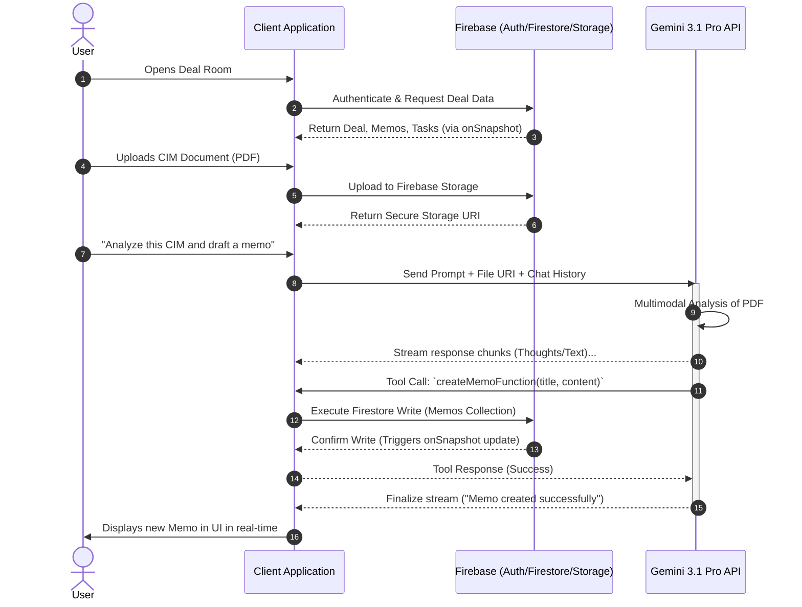

# 🏢 TIGGY: Enterprise Tech Due Diligence & AI Copilot


**TIGGY** is a highly secure, multi-tenant Technology Due Diligence platform tailored specifically for Bain TIG (Technology & Innovation Group) professionals. Built for the high-stakes, fast-paced environment of Private Equity M&A, it combines real-time collaboration, secure document management, and a context-aware AI Copilot powered by Google's Gemini 3.1 Pro to accelerate tech diligence, automate risk scoring, and generate actionable IC memo insights.

---

## ✨ Key Features

*   **Deal Pipeline Management:** Track target companies, enterprise values (EV), and diligence statuses across the firm.
*   **Secure Data Room:** Upload, manage, and preview CIMs, financial models, and technical architecture documents (supports PDF, PPTX, XLSX, DOCX, Images).
*   **Agentic AI Copilot:** Context-aware chat powered by Gemini 3.1 Pro that can analyze uploaded documents, answer diligence questions, and draft memos.
*   **Automated IC Memos:** Generate Investment Committee memos directly from chat interactions and data room files, with rich Markdown rendering.
*   **Task Tracking:** Assign and track diligence tasks, risks, and remediation items.

---

## 🛠️ Tech Stack

*   **Frontend:** React 18, TypeScript, Vite
*   **Styling & UI:** Tailwind CSS, shadcn/ui, Framer Motion, Lucide Icons
*   **Backend & Database:** Firebase Auth, Cloud Firestore (NoSQL), Firebase Storage
*   **AI & LLM:** Google Gemini 3.1 Pro API (`@google/genai`)
*   **Markdown Rendering:** `react-markdown` with `remark-gfm`

---

## 📁 Project Structure

```text
tiggy/
├── src/
│   ├── components/       # Reusable UI components (Chat, FileUpload, Layout, etc.)
│   ├── components/ui/    # shadcn/ui base components (buttons, dialogs, inputs)
│   ├── lib/              # Utility functions, Firebase initialization, AI tool definitions
│   ├── pages/            # Main route components (Dashboard, DealRoom, Settings)
│   ├── App.tsx           # Main application router and Auth provider wrapper
│   ├── index.css         # Global Tailwind CSS and Brutalist design variables
│   └── main.tsx          # React entry point
├── firestore.rules       # Firebase Security Rules for database access control
├── storage.rules         # Firebase Security Rules for asset storage
└── package.json          # Dependencies and build scripts
```

---

## 🏗️ Detailed System Architecture

The application follows a modern, serverless, event-driven architecture utilizing Firebase for real-time backend services and Google Gen AI for intelligent, agentic features.

```text
+-----------------------------------------------------------------------------------------+
|                                  CLIENT TIER (React 18 + Vite)                          |
|                                                                                         |
|  +--------------------+  +-----------------------+  +--------------------------------+  |
|  |   Auth Context     |  |    Deal Room State    |  |      AI Chat Interface         |  |
|  | (Google Provider)  |  | (Zustand/React State) |  | (Streaming UI, Markdown Render)|  |
|  +---------+----------+  +-----------+-----------+  +----------------+---------------+  |
|            |                         |                               |                  |
+------------|-------------------------|-------------------------------|------------------+
             | JWT                     | CRUD / onSnapshot             | Prompt / Tools
             v                         v                               v
+-----------------------------------------------------------------------------------------+
|                                 DATA & SECURITY TIER                                    |
|                                                                                         |
|  +--------------------+  +-----------------------+  +--------------------------------+  |
|  |   FIREBASE AUTH    |  |   CLOUD FIRESTORE     |  |        FIREBASE STORAGE        |  |
|  | - Identity Mgmt    |  | - Users, Deals, Memos |  | - Data Room Assets (PDF, PPTX) |  |
|  | - Domain Parsing   |  | - Tasks, Messages     |  | - AI Generated Images          |  |
|  +---------+----------+  +-----------+-----------+  +----------------+---------------+  |
|            |                         |                               |                  |
|            +-------------------------+-------------------------------+                  |
|                                      |                                                  |
|                        +-------------+-------------+                                    |
|                        | FIREBASE SECURITY RULES   |                                    |
|                        | - Tenant Isolation (RBAC) |                                    |
|                        | - Schema Validation       |                                    |
|                        +-------------+-------------+                                    |
+--------------------------------------|--------------------------------------------------+
                                       | Context, History, File URIs
                                       v
+-----------------------------------------------------------------------------------------+
|                                   INTELLIGENCE TIER                                     |
|                                                                                         |
|  +-----------------------------------------------------------------------------------+  |
|  |                           GOOGLE GEMINI 3.1 PRO API                               |  |
|  |                                                                                   |  |
|  |  [Core Capabilities]                  [Function Calling / Tools]                  |  |
|  |  - Multimodal Analysis (Vision/Text)  - createMemoFunction()                      |  |
|  |  - Streaming Responses                - readMemoFunction()                        |  |
|  |  - Google Search Grounding            - updateTaskFunction()                      |  |
|  |                                       - analyzeDataRoomFileFunction()             |  |
|  |                                       - updateDealMemoryFunction()                |  |
|  +-----------------------------------------------------------------------------------+  |
+-----------------------------------------------------------------------------------------+
```

---

## 🔄 Sequence Diagram: AI Copilot Interaction

This sequence diagram illustrates the flow of data when a user interacts with the AI Copilot to analyze a document and generate an Investment Committee (IC) memo.



---

## 🧠 Core Technical Implementations

### 1. Agentic AI Copilot (Gemini 3.1 Pro)
The AI integration goes beyond simple text generation. It acts as an autonomous agent within the deal room using the **Gemini Interactions API** and **Function Calling (Tools)**.
*   **Gemini Interactions API:** We leverage the latest `@google/genai` SDK and the Gemini Interactions API to facilitate real-time, streaming conversations (`generateContentStream`) between the user and the AI, providing a seamless, low-latency chat experience.
*   **Context Window Management:** The chat component fetches the entire `messages` collection scoped to the specific `dealId` and formats it into a continuous conversation history for the Gemini model, ensuring deep contextual awareness of the deal's diligence phase.
*   **Grounding:** Utilizes Google Search grounding to pull in real-time market data and news regarding target companies.

#### 🤖 AI Function Calling (Tools)
The AI is equipped with `FunctionDeclaration` objects allowing it to execute backend operations directly from the chat interface. These tools bridge the gap between conversational AI and stateful application logic:
*   `createMemoFunction`: Drafts and saves new Investment Committee (IC) memos directly to the database.
*   `readMemoFunction`: Reads existing memos to provide context, summarize findings, or suggest edits.
*   `updateTaskFunction`: Creates, updates, or completes diligence tasks and risk remediation items.
*   `analyzeDataRoomFileFunction`: Extracts and analyzes text from uploaded documents (PDFs, CIMs) in the Data Room.
*   `updateDealMemoryFunction`: Updates the core deal state (e.g., changing the deal status from "Sourcing" to "Diligence", or updating the Enterprise Value).

### 2. Zero-Downtime Multi-Tenant Migration Engine
To support enterprise scaling, the app employs a strict domain-based multi-tenant architecture. To handle legacy data without downtime or manual database scripts, a **Client-Side Auto-Migration Engine** is implemented:
*   **In-Memory Filtering:** The client fetches data ordered by creation date and filters it in-memory (`!d.tenantId || d.tenantId === tenantId`) to ensure legacy data remains visible to the original creators.
*   **Background Upgrades:** As legacy data is loaded into the UI, a background `useEffect` process iterates through documents missing a `tenantId` and executes an `updateDoc` to stamp them with the user's current tenant ID, seamlessly upgrading the database schema in real-time.

### 3. Real-Time Reactivity (`onSnapshot`)
The application relies heavily on Firebase's WebSocket-based `onSnapshot` listeners rather than traditional REST polling.
*   When a user opens a Deal Room, multiple listeners are attached to `files`, `memos`, `tasks`, and `messages` collections.
*   Any mutation (from the user, a collaborator, or the AI Copilot) instantly triggers a React state update, providing a synchronous multiplayer experience.

### 4. Secure Asset Management & Markdown Rendering
The Data Room utilizes **Firebase Storage** for secure file uploads. 
*   **Access Control:** Files are protected by Firebase Security Rules, ensuring only authorized tenant members can access deal-specific documents.
*   **Rich Markdown Integration:** The AI Copilot generates memos using Markdown. To securely render AI-generated images and external assets stored in Firebase Storage within the `react-markdown` component, strict `referrerPolicy="no-referrer"` attributes are injected into custom image renderers, bypassing strict modern browser cross-origin tracking protections while maintaining security.

---

## 🎨 UI/UX & Design System

TIGGY employs a **Brutalist / Technical Utility** design language to reflect the serious, data-dense nature of M&A due diligence:
*   **High Contrast:** Stark black borders (`border-2 border-black`), solid white backgrounds, and bold typography ensure maximum readability.
*   **Hard Shadows:** Elements use solid, unblurred drop shadows (e.g., `shadow-[8px_8px_0px_0px_rgba(0,0,0,1)]`) to create a tactile, physical "document" feel.
*   **Responsive Layouts:** Mobile-first Tailwind utility classes ensure the complex Deal Room interface gracefully collapses on smaller screens (e.g., defaulting to the Data Room tab and hiding the AI chat panel on mobile).

---

## 🛡️ Advanced Security & Compliance

Security is enforced at the database level using complex Firestore Security Rules, ensuring compliance with financial institution standards (SOC 2, ISO 27001).

### Strict Tenant Isolation & Legacy Support
Rules dynamically check the user's JWT token to extract their email domain and enforce tenant boundaries, while safely allowing the migration of legacy data:

```javascript
function getTenantId() {
  return request.auth.token.email.split('@')[1];
}

function isLegacyOrSameTenant(resourceData) {
  // Allows access if the document belongs to the user's firm, 
  // OR if it's a legacy document pending auto-migration.
  return isAuthenticated() && (!('tenantId' in resourceData) || resourceData.tenantId == getTenantId());
}
```

### Immutable Audit Trails & Schema Validation
Every collection enforces strict schema validation and prevents tampering with audit fields (`createdAt`, `createdBy`).

```javascript
// Example: Task Update Validation
allow update: if isLegacyOrSameTenant(resource.data) && 
              isValidTask(request.resource.data) &&
              isSameTenant(request.resource.data.tenantId) &&
              request.resource.data.dealId == resource.data.dealId && // Immutable relationship
              request.resource.data.createdBy == resource.data.createdBy && // Immutable author
              request.resource.data.createdAt == resource.data.createdAt; // Immutable timestamp
```

---

## 🗄️ Database Schema (TypeScript Definitions)

The NoSQL database is strictly typed on the client and validated on the server.

```typescript
interface User {
  uid: string;
  email: string;
  displayName: string;
  photoURL: string;
  role: 'admin' | 'consultant';
  tenantId: string; // e.g., "bain.com"
  createdAt: ISOString;
}

interface Deal {
  id: string;
  name: string;
  targetCompany: string;
  status: 'sourcing' | 'diligence' | 'closed' | 'passed';
  ev: number; // Enterprise Value
  tenantId: string;
  createdBy: string; // User UID
  createdAt: ISOString;
  updatedAt: ISOString;
}

interface Message {
  id: string;
  dealId: string;
  role: 'user' | 'model';
  content: string;
  tenantId: string;
  userId?: string; // Only present for 'user' role
  groundingUrls?: string[]; // Present if AI used Google Search
  createdAt: ISOString;
}
```

---

## 🗺️ Roadmap

The TIGGY platform is under active development. Our upcoming features include:

*   **Multi-User Real-Time Presence:** See who else is in the Deal Room with live cursors and presence indicators.
*   **Advanced Data Visualization:** Integrated D3.js charts for visualizing financial metrics, tech stack dependencies, and risk distributions.
*   **Automated Risk Scoring:** An AI-driven engine that automatically scores target company tech stacks based on uploaded architecture documents.
*   **Remediation Tracking Integrations:** Direct sync with Jira and GitHub to track post-close remediation items and technical debt.
*   **Export to PDF/DOCX:** One-click export of AI-generated IC memos and diligence reports to professional document formats.

---

## 🤝 Contribution

We welcome contributions from the Bain TIG community! To contribute:

1.  **Fork the Repository:** Create your own copy of the project.
2.  **Create a Feature Branch:** `git checkout -b feature/amazing-feature`
3.  **Commit Your Changes:** `git commit -m 'Add some amazing feature'`
4.  **Push to the Branch:** `git push origin feature/amazing-feature`
5.  **Open a Pull Request:** Submit your changes for review.

---

## 💻 Development Guide

### Prerequisites
*   Node.js 18+
*   Firebase Project (Authentication, Firestore, Storage enabled)
*   Google Gemini API Key

### Setup Instructions

1. **Clone & Install:**
   ```bash
   npm install
   ```

2. **Firebase Project Setup:**
   *   **Authentication:** Enable the **Google** Sign-In provider in the Firebase Console.
   *   **Firestore Database:** Create a Firestore database in production mode.
   *   **Storage:** Enable Firebase Storage. **Crucial:** You must configure CORS on your Storage bucket to allow the frontend to upload and read files.
       *   Create a `cors.json` file: `[{"origin": ["*"], "method": ["GET", "POST", "PUT", "DELETE", "HEAD"], "maxAgeSeconds": 3600}]`
       *   Apply it via Google Cloud CLI: `gcloud storage buckets update gs://YOUR_BUCKET_NAME --cors-file=cors.json`

3. **Environment Configuration:**
   Create a `.env` file in the root directory:
   ```env
   # Google Gen AI
   GEMINI_API_KEY=your_gemini_api_key

   # Firebase Configuration (Vite Prefix)
   VITE_FIREBASE_API_KEY=your_api_key
   VITE_FIREBASE_AUTH_DOMAIN=your_auth_domain
   VITE_FIREBASE_PROJECT_ID=your_project_id
   VITE_FIREBASE_STORAGE_BUCKET=your_storage_bucket
   VITE_FIREBASE_MESSAGING_SENDER_ID=your_sender_id
   VITE_FIREBASE_APP_ID=your_app_id
   ```

4. **Deploy Security Rules:**
   Ensure your Firestore and Storage rules are up to date to prevent permission errors:
   ```bash
   firebase deploy --only firestore:rules,storage:rules
   ```

5. **Run Development Server:**
   ```bash
   npm run dev
   ```
   The Vite HMR server will start on `http://localhost:3000`.

### Build & Deployment
```bash
npm run build
```
This compiles the React application using `tsc` and bundles it via Vite into the `/dist` directory, ready for static hosting.

To deploy to Firebase Hosting:
```bash
firebase deploy --only hosting
```
